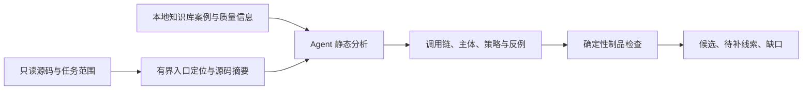

# 面向 Agent 的漏洞挖掘设计与首版实现

本期只实现静态挖掘：从当前源码建立工具调用与权限边界，参考本地 KnowledgeWorkFlow 案例形成候选。不构建攻击 prompt，不调用目标 API/function/skill/MCP，不执行目标代码，不进行动态复现或最终漏洞裁决。`test0928` 及其结果不参与本次开发。

## 范围和判断标准

| 风险族 | 覆盖入口 | 必须建立的证据 | 重要反例 |
|---|---|---|---|
| TOOL_RCE | API call、function call、skill、MCP | 低信任输入经工具分派进入命令/代码/模块或脚本装载；执行超出调用者获准能力；区分宿主、隔离环境和未知环境 | 管理员明确获准执行代码；固定程序与受限参数；没有证明宿主逃逸的隔离解释器 |
| TOOL_AUTHZ | 同上四类工具调用 | 调用者权限与最终工具、参数、资源、运行身份不一致；列出绕过的分支和应执行的策略 | 工具列表过滤与执行侧统一授权均生效；别名解析后重新检查；审批绑定最终操作 |
| FRAMEWORK_ACCESS | 同上四类入口背后的 Agent 框架 | 身份获取、会话/任务归属、工作区/租户、委派、恢复与替代传输的实际授权链 | 公共入口使用受限身份；对象属于已授权父资源；外层守卫确实支配敏感调用 |

API/function/skill/MCP 是调用边界，不能因出现相关名称就认定有漏洞。工具本来具有执行能力也不自动等于 RCE。必须区分“能力存在”“调用者能触达”“权限边界被突破”和“实际执行环境”。不把工具权限强行套入只描述数据库资源的 BAC D/O/R/AC 模型。

## 数据流



1. `prepare` 读取源码，生成带文件摘要和行号的定位线索、三类风险 × 四种调用边界的检查矩阵及分析模板。定位器是有界词法检索，不冒充 AST 调用图；未命中不能关闭覆盖。
2. 知识查询使用已有只读适配器。每个选定风险族取一个直接相关案例，保存本次查询快照、来源摘要、质量和警告；Agent 可通过原接口补查根因和相关案例。`blind` 在查询前隔离知识，库缺失或过期保留缺口，静态继续。
3. Agent 逐跳追踪 `entry → dispatch → execution`，记录 caller、执行身份、授权策略、有效配置、外层守卫、替代入口，以及工具参数在授权后是否发生变化。已读文件以摘要绑定；未知控制不能填成“缺失”。
4. `finish` 检查绑定、源码摘要、行号、调用边、必要事实、覆盖矩阵和知识引用，生成标准任务报告与回执。不重写模型判断，不自动确认漏洞。事实不足的记录降为 `LEAD`，不会进入候选列表。
5. 原生 `task-board.v1` 的 `ai` 任务可显式选择此挖掘配置。平台在 worker 启动前准备附件；Agent 完成分析文件后由 CLI 一次生成报告和回执，避免反复手工拼接大型 Finding。该配置不会开启运行测试。

## 知识依据

设计时只读查询当前本地知识库，查询快照位于 `tmp/agent-mining-design-20260928/`；这不是对历史漏洞的重新验证。检索状态为 PARTIAL，含归档未纳入根因复核的警告。下列案例只供理解机制，部署版本和当前源码必须另行核实。

| 案例 | 本期提炼的检查条件 |
|---|---|
| CVE-2026-22688，WeKnora | MCP command/args/env 的配置权限不等于宿主进程执行权限；检查创建、更新、连接全部路径 |
| CVE-2026-55582，MCP Shell | 程序名允许列表不能覆盖参数、环境、包装器与二次执行能力 |
| CVE-2026-53845，OpenClaw | skill 的直接工具分派分支也须经过统一策略钩子，已有 owner 检查不能替代其他必要策略 |
| CVE-2026-62209，ClickClack | 不同 agent-mode 执行分支都须实施 toolsAllow |
| CVE-2026-40117 | 子路径在调用者自行选择的 skill 根下，不代表该根已被授权 |
| CVE-2026-18891，Langflow | 公共 MCP 项目的匿名访问不能升级为实例超级用户 |
| CVE-2026-47419，PraisonAI | 检查工作区成员身份之后，仍须绑定被操作 Agent 的工作区归属 |

根因参考：MECH-CMD-001、MECH-CODE-001、MECH-EXEC-POLICY-001、MECH-ENFORCE-001、MECH-POLICY-001、MECH-APPROVAL-001、MECH-AUTH-001。库中 draft/report_only/not_evaluated 等标签原样保留，不升级证据等级。

## 交付与限制

- 每个风险/边界格记录 `INSPECTED`、`NOT_APPLICABLE` 或 `GAP`，并绑定实际源码；任务范围外可说明不适用，不能据此声称仓库没有该类风险。
- 候选包含输入控制、调用链边、实际执行身份、应有策略、控制事实、影响与反例。`CANDIDATE` 只代表进入后续评估；动态执行始终 `NOT_RUN`，最终裁决 `NOT_ASSESSED`。
- 无完整链条、外层授权未知、远端工具实现不可见、未能证明隔离边界失效等情况保留 `LEAD`/GAP。
- 扫描跳过的符号链接、大文件、文件数或字节上限均可见。文件摘要漂移阻止旧证据交付。定位器不保证跨语言或动态分派穷尽；完整性由 Agent 对任务范围内的实际检查支持。
- 当前只落地源码挖掘及任务报告接入；验证用 prompt、动态测试、利用载荷、框架专用执行适配和自动最终判定均不在本期。

## 使用入口

任务发布时添加如下字段，kind/source_ref/code_refs 继续遵守现有 Focus Area 或 API 任务协议：

```json
{
  "domain": "ai",
  "agent_mining": {
    "profile": "agent-tool-boundaries.v1",
    "families": ["TOOL_RCE", "TOOL_AUTHZ", "FRAMEWORK_ACCESS"],
    "track": "coverage"
  }
}
```

独立准备计划使用 `node .opencode/scripts/agent-mining.mjs --help` 查看参数。CLI 的 output-root 必须在只读源码根之外。平台 worker 的实际会话记录用于 finish；不要自行伪造真实审计会话。测试入口是 `npm --prefix .opencode run test:agent-mining`。

原生集成仅影响显式选择此配置的新任务；开发时不重启工作台、不重写运行中任务。部署新进程后，新任务才能加载本次服务端代码。

## 本次验证记录

2026-09-28：新增 24 项测试全部通过，涵盖三类风险与四种工具边界的证据制品、未知/安全反例、知识质量、盲测隔离、路径限制、源码漂移、会话绑定、CLI 及原生任务执行器接入。用例不运行目标代码，也不代表已对真实 Agent 项目测得召回率。

配置校验和 skill 校验通过。既有任务面板与 BAC 回归 26 项中 23 项通过，3 项因当前沙箱禁止监听 `127.0.0.1` 而报 `listen EPERM`，本次未完成这三个网络集成用例；未据此改写调度规则或现有测试。

真实 KnowledgeWorkFlow 只读准备成功读取三个案例，保留 PARTIAL 警告与 fix_diff/report_only 区别。使用独立静态样本完成，耗时约 11.5 秒；记录见 `tmp/agent-mining-design-20260928/integration/verification.json`。这只是接口与制品集成检查，不是漏洞动态验证或通用性能基准。
