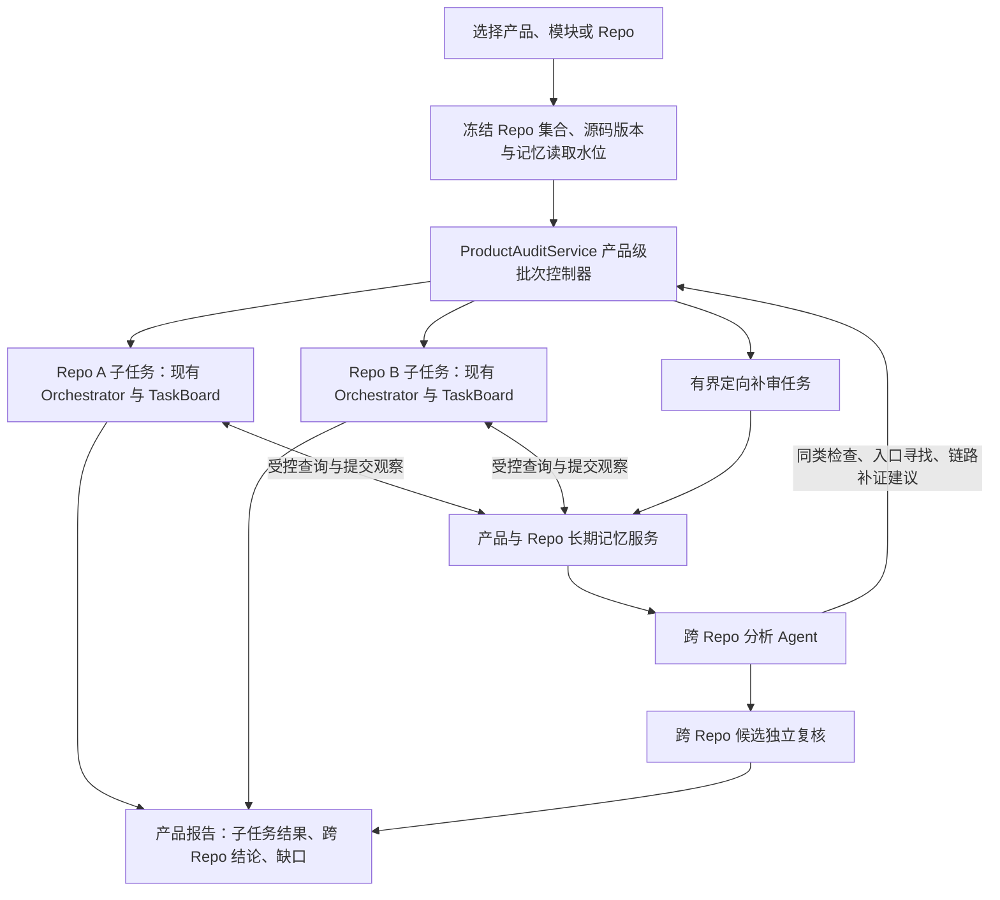

# 产品多 Repo 审计与长期记忆设计

状态：拟议方案，尚未实现。日期：2026-09-29。

用户已确认：目标树中混合存在 Git 仓库和无 Git 信息的源码目录。本文基于当前源码核查，不把旧设计文档中的规划视为已实现能力。本轮只增加设计文档，不启动审计、不改变运行中任务。

## 1. 设计结论与现状

推荐新增三项相互配合的能力：产品目录树、产品级审计批次、产品/Repo 两级长期记忆。产品级批次协调各 Repo 的既有审计流程，长期记忆保存版本化事实、判断及理由、跨 Repo 线索和后续工作，跨 Repo 分析负责关联与补审。

| 当前代码事实 | 本次改造 |
|---|---|
| ProductStore 已用 SQLite 保存 products、audit_targets、source_scopes、产品事件 | 扩展根目录绑定、模块树、稳定 Repo 身份与目录发现记录 |
| 产品仅有名称、说明、标签等，尚无目录树发现 | 创建产品绑定目录后异步发现并登记 Repo，允许调整识别边界 |
| 审计对象可保存多个 source_scopes，但 createAuditFromTarget 拒绝多范围执行 | 引入产品级父批次与 Repo 子任务，另交付跨 Repo 分析链；不直接移除旧门禁 |
| include/exclude 范围规则可保存，但当前 Runner 同样拒绝带规则执行 | 在需要嵌套 Repo 排除、组件范围等场景前，完成范围枚举器及所有消费方的契约接入 |
| TaskBoardService 和任务 code_refs 以单一 source_root 为边界 | 普通子任务继续单 Repo；跨 Repo 执行与证据使用显式多源清单 |
| TaskBoard 的完成度主要是任务报告交付，API 统计依据用户清单 | 新增文件、接口、风险维度的结构化覆盖事实，和报告交付进度分别展示 |
| 漏洞列表已有处理状态、备注、版本检查和幂等写入 | 增加独立人工判定、整改状态、理由、适用范围、问题关联与完整变更历史 |
| FindingWorkflow 当前保存最新 note，事件只有 note_present 等摘要 | 新事件保存每次理由；迁移时不伪造已丢失的旧理由 |
| KnowledgeWorkFlow 已通过只读 CLI 提供机制、案例、规则和质量信息 | 继续作为通用知识库；产品经验保存在平台自身存储 |

核查入口：

- [.opencode/web/dynamic-validation-observatory/product-store.mjs](../.opencode/web/dynamic-validation-observatory/product-store.mjs)
- [.opencode/web/dynamic-validation-observatory/audit-runner.mjs](../.opencode/web/dynamic-validation-observatory/audit-runner.mjs)
- [.opencode/web/dynamic-validation-observatory/finding-workflow.mjs](../.opencode/web/dynamic-validation-observatory/finding-workflow.mjs)
- [.opencode/web/dynamic-validation-observatory/public/app.js](../.opencode/web/dynamic-validation-observatory/public/app.js)
- [.opencode/lib/task-board/service.mjs](../.opencode/lib/task-board/service.mjs)
- [.opencode/lib/task-board/contract.mjs](../.opencode/lib/task-board/contract.mjs)
- [.opencode/lib/task-board/review.mjs](../.opencode/lib/task-board/review.mjs)
- [.opencode/lib/knowledge-workflow.md](../.opencode/lib/knowledge-workflow.md)

旧的 [产品空间设计](product-space-and-audit-target-design.md) 提供可复用概念，但其中旧 Stage/跨范围阶段和动态环境限制不直接沿用；执行以当前 task-board.v1 与现行授权边界为准。

## 2. 产品目录树与 Repo 身份

### 2.1 用户看到的对象

```text
产品 P，绑定 /work/product-p
├── gateway/                 模块
│   ├── gateway-server/      Repo，Git
│   └── gateway-sdk/         Repo，无 Git 源码
└── agent-platform/          模块
    ├── agent-server/        Repo，Git
    └── tool-service/        Repo，无 Git 源码
```

用户可以从产品、任一模块或单个 Repo 发起审计。选择模块时，实际范围是该模块下本次选中的 Repo 集合。Repo 是产品树的逻辑叶子；其 src、test 等源码目录仍属于该 Repo。

保留 AuditTarget 作为可复用的范围选择。它可以引用一个 Repo、一个模块、整个产品或显式 Repo 集合。真正执行时，把选择解析成不可变的 Repo/源码范围清单；树后续变化不改变已经创建的批次。单 Repo 内的组件目录审计绑定同一个 repo_id，并记录子范围，避免把每次子目录审计变成新 Repo。

### 2.2 目录发现规则

1. 优先应用保存在平台中的边界覆盖规则：设为模块、设为 Repo、忽略、与已有 Repo 关联。审计源码目录保持只读。
2. 无人工规则时，识别 `.git` 目录及 worktree/submodule 的 `.git` 文件；只读取必要元信息，不运行 Git hooks、不 checkout、不克隆或更新源码。
3. 无 Git 目录综合构建入口、包清单、源码布局与兄弟目录识别源码根。构建清单只能作为证据：同一源码树内的多包清单不能自动等同多个 Repo。
4. 能明确识别的 Repo 自动纳入产品；不确定目录保留为待识别节点，并给出依据。用户可以直接在树上修正边界，也可导入明确的目录映射。无法区分“无 Git 多模块项目”和“多个源码导出仓库”时不伪造精确边界。
5. 识别到 Repo 后，不再把其普通源码子目录加入产品模块树。嵌套仓库和 submodule 单独登记关系；执行清单必须确定唯一文件归属或显式保留重叠，不能重复计入覆盖。
6. 遍历有深度、目录数、时间与结果分页预算；跳过缓存和构建产物的规则可见且可配置。软链接不自动扩展产品边界；不可读、循环、超预算和未识别项进入发现缺口。

创建产品提交根目录绑定后立即启动发现作业。后续提供“刷新目录树”，并可配置周期检查；页面列表读取目录索引，不临时扫描磁盘。创建审计时检查发现结果和目录可用性，冻结本次范围。

发现采用“扫描 → 差异结果 → 事务提交”。完整扫描中的新增节点自动登记，消失节点标记 MISSING 并保留历史。扫描不完整时，未看到的节点标记 UNKNOWN，不能批量推断已删除。后台刷新不启动审计。

### 2.3 稳定身份

- 产品、模块、Repo 使用服务端生成的稳定 ID；规范路径作为可变绑定。历史兼容字段 repository_id 仍按原 target_id 含义解释，新增 repo_id，不能直接重命名旧字段。
- Repo 在同一产品中改名、换目录后可保持身份与记忆。路径消失又出现相似目录时，先提出重关联建议；只有身份依据充分或用户明确关联才继承。
- 相同 Git remote、名称或相似内容不足以合并 Repo。fork、不同部署副本、worktree 和无 Git 导出版本需要明确身份及分支/版本关系。
- 一个目录出现在两个产品中时，产品经验保持隔离。受控的归属转移需要显式处理记忆与跨 Repo 关系；不按路径自动共享。
- 模块移位只改变当前树关系。历史审计保存创建时的路径、模块树代次和 Repo 集合。

## 3. 产品级审计执行



新增 `product-audit.v1` 父批次协议。普通 Repo 子任务复用当前单根执行路径、专业 Worker 和复核流程；父批次记录 child_audit_id、repo_id、snapshot_id、状态和制品摘要。单 Repo 审计同样可读写记忆，不要求用户创建可见的多 Repo 批次。

产品级控制器用代码管理身份、快照、派发、重试、预算和完成条件。产品威胁规划可复用 security-threat-modeler 的独立会话。新增 `security-cross-repo-analyzer` 职责处理关系匹配、待办和链路候选，按事件批次启动有界会话；不设置永不结束的常驻推理 Agent。

跨 Repo 分析可从各 Repo 的接口/资产清单以及阶段性观察开始，不必等全部漏洞确认。阶段性信息带 OBSERVED/PROPOSED 等状态，不能被当作已确认漏洞。最终产品报告必须包含实际的跨 Repo 分析覆盖或缺口，不能把多个子报告拼接称为联合分析完成。

### 3.1 源码版本与位置

执行前建立 `repo_snapshot`：Git 信息为可选元数据；文件摘要、范围规则、枚举器版本和未读项才是实际工作树依据。Git commit 不能替代 dirty/untracked 文件状态；无 Git 场景使用同样的内容摘要。

产品批次保存明确的版本向量 `repo_id → snapshot_id`。逐 Repo 读取不是文件系统原子快照；冻结期间和读取证据时检查漂移，不能声称所有 Repo 同时原子冻结。一个产品发行版本还需记录依赖锁定、配置或用户提供的版本对应关系。

跨 Repo 位置采用 `repo_id + snapshot_id + scope_id + relative_path + file_sha256 + line/symbol`。同名文件和同名接口不会碰撞。跨 Repo Agent 获得有摘要的 `source_manifest`，仅能把其中的范围作为当前证据；不把公共父目录或第一个 Repo 伪装成所有源码范围。

补审前重新核对相关文件和依赖。源码已经变化、又没有可读取的原版本时，原版本补审记为 STALE；使用新源码需要建立新的版本绑定，不把新旧证据拼成原批次的确定结论。

现有 finding-v2、BAC、Agent 专项可在 Repo 内保留原契约，外围补充身份绑定。跨 Repo 边、链路、复核输入、报告、下载及定位解析需要一起交付新版契约与适配器；不能只加 prompt。

### 3.2 调度、补审与封存

- 全平台 Agent 名额统一管理，再设置产品和 Repo 配额；不能每个子任务各自无限占用默认 4 个并发。现有同领域串行规则在 Repo 子任务内保留，产品间公平调度。
- 普通子任务完成后，封存结果不再改写。新线索需要更多工作时，创建关联的定向补审批次/工作包，复用绑定源码版本和已验明事实，不重复整轮 Recon。
- 现有 TaskBoard 的 SEALED 不重新打开。产品级补审有独立任务记录；不把新的 API 或跨 Repo 工作偷偷加入已冻结的接口分母。
- 每个补审记录来源 TODO、输入版本、幂等键、截止条件、已做尝试与新增证据。建议初始自动补审最多 2 轮，具体预算可配置；相同输入不重复派发。
- 父批次进入收尾后冻结其关联事件水位；已有工作在预算内收齐，剩余 TODO 转入后续工作。子任务失败、未读 Repo 或未完成关联均保留，批次只能交付 PARTIAL 等明确状态。
- 暂停、恢复、取消以持久任务状态和租约为准；恢复不重复启动同一任务。总进度分别显示 Repo 完成度、任务报告交付度、源码/API 覆盖度和关联待办。

目录自动加载和记忆中的测试请求都不授予动态测试权限。本方案先完成静态执行与关联；后续动态仍使用显式授权、私有环境和现有受控执行器，不把凭据放入记忆。

## 4. 长期记忆的内容与存储

### 4.1 三种知识来源

| 来源 | 保存内容 | 使用方式 |
|---|---|---|
| 通用知识库 KnowledgeWorkFlow | 历史案例、根因机制、规则、反例、质量标记 | 按现有只读接口查询，提供通用检查方法 |
| Repo Memory | 接口/工具入口、价值资产、角色策略、调用与依赖、覆盖事实、历次问题、人工理由、修复验证 | 下次同 Repo 审计提取相关先验，与当前版本对比 |
| Product Memory | 模块/服务拓扑、共享组件、跨 Repo 关系、同类风险经验、问题组、链路与待办 | 在产品内传播检查建议、寻找入口、关联重复与影响 |

长期记忆以结构化记录和可追溯证据为主，摘要用于导航。持久化复用本机 SQLite，证据和大清单保存在平台受控目录；首版使用结构化检索和关键词索引，后续向量索引只能作为可重建的召回层。

产品目录、问题身份、人工判断和待办是权威记录，必须备份。全文索引、摘要与匹配候选可以重建。Agent 不直接写数据库；由平台内的单写入服务接收、校验并提交事件和投影，避免并行会话覆盖状态。

### 4.2 Repo 层最小记录

| 类型 | 主要字段与含义 |
|---|---|
| SourceSnapshot | repo_id、工作树摘要、版本/分支线索、范围、排除项、完整性、生成工具版本 |
| InterfaceObservation | 接口稳定身份、协议、服务命名空间、方法/路由或 tool 名、入口位置、参数、认证与授权条件 |
| AssetObservation | 数据/文件/执行能力等资产、拥有者、访问角色、相关入口、证据及未确定项 |
| RelationObservation | 调用、导入、RPC、消息、依赖、身份传播、数据流等关系及证据 |
| CoverageObservation | 本轮在哪个文件/接口/风险维度做了哪种检查、由谁完成、方法、证据、缺口 |
| FindingObservation | 某一次审计产生的候选、反证、静态复核、动态结果及输入版本，保持不可变 |
| Issue | 同一问题跨审计的稳定身份、各次观察、首次/最近出现、整改状态 |
| FeedbackEvent | 人工判断、具体理由、证据、适用范围、版本、操作者、时间、被替代事件 |
| Lesson / Followup | 可迁移的检查条件、适用框架/配置、反例、来源问题、待办与有效期 |

接口 ID 与本次审计的 API source_id 分开。后者当前包含顺序和原始文本摘要，适合任务清单；跨轮次对比需要稳定服务/协议/操作身份。重命名、路由别名和动态注册无法确定时产生匹配候选，不把低置信度匹配当事实。

每条记录包含来源 audit/task/session、repo/snapshot、提取方法、证据引用及摘要、观察时间、适用条件、质量状态。源码事实、模型推断、人工意见、动态观测分别标记；版本号可校验不等于语义已证明。

### 4.3 比较与复用

默认选择同 Repo、同演进分支/版本关系、范围可比的最近可用基线，也允许指定历史版本。接口/资产给出 ADDED、REMOVED、MODIFIED、UNCHANGED、UNKNOWN；先比较清单完整性与提取器能力。

“未在本轮看见”只有在相关范围完整检查后才能记为 REMOVED。提取失败、范围缩小、Repo 离线或分析器不同导致不可比时保留 UNKNOWN。旧任务缺少结构化清单的部分明确为未记录。

复用分三个层次：

1. 文件、解析方法及相关配置未变化时可复用定位与清单结果，保留来自历史的标记。
2. 覆盖事实还需核对入口、依赖、配置、策略、分析方法及风险维度；文件未变本身不能证明仍然安全。
3. 漏洞判定与修复验证必须检查当前版本关键条件。历史已确认/误报是带条件的先验，不直接生成本轮 TRUE_POSITIVE 或自动屏蔽候选。

覆盖展示区分“已枚举、已运行扫描、已静态审查、已动态测试、历史结果复用、未覆盖”，分别记录版本和范围。不得将文件被读取、工具启动或任务报告交付当作完整漏洞覆盖。

增量优先规划：新/变化入口、影响到的依赖与控制、历史确认问题的修复回归、历史误报理由的有效性、同类风险以及上轮缺口。用户选择全量时仍执行本轮完整计划；记忆命中不自动缩小范围。

## 5. 人工反馈与漏洞列表

将当前混合状态拆成独立维度，保留原状态作为兼容展示：

| 维度 | 示例 |
|---|---|
| 系统审计结论 | CANDIDATE、TRUE_POSITIVE、FALSE_POSITIVE、INCONCLUSIVE |
| 人工判断 | UNREVIEWED、TRUE_POSITIVE、FALSE_POSITIVE、INSUFFICIENT_EVIDENCE |
| 整改状态 | OPEN、FIX_IN_PROGRESS、FIX_CLAIMED、FIX_VERIFIED、REOPENED、RISK_ACCEPTED |
| 关联关系 | SAME_ISSUE、SAME_ROOT_CAUSE、SAME_PATTERN、COMPOSES_WITH、duplicate_of |
| 动态证据状态 | 沿用现有执行和证据状态，独立展示 |

漏洞列表增加人工判断、整改状态、历史出现次数、问题组、关联 Repo、待补证等列；详情显示每轮证据与完整反馈时间线。提供“标记真实漏洞”“标记误报”“证据不足”“关联重复”“提交修复说明”“创建补审待办”。

确认/误报等判断要求理由，可附原因类别和证据位置；设置重复关系必须选择目标问题并说明依据。默认判断作用于当前观察和其版本，用户可指定问题级适用条件，但不自动覆盖同类问题。批量操作逐项绑定目标和版本，不能覆盖中途已变更记录。

反馈事件完整保存前后值、理由、适用范围、实际操作者、时间、版本与幂等键。无账户体系时标为本地操作者，不编造审核人。Agent 可以提出建议，不能写入 HUMAN_CONFIRMED 等人工权限状态。

例如：上轮误报理由为“所有入口都经过 tenant_guard”。下轮先检查 guard 是否仍然支配相关调用及是否新增旁路；理由不再成立时创建重新审查记录。上轮用户声称已修复只能进入 FIX_CLAIMED，当前证据足够后才更新为 FIX_VERIFIED。

人工反馈与机器结论冲突时并列保存并触发复核。旧审计报告和已封存制品不回写；最新问题视图与下一轮报告反映后续判断。

## 6. 产品级关联、去重与链路

### 6.1 分开处理三类关系

| 场景 | 处理 |
|---|---|
| A 发现某类框架授权缺陷，B 使用相同框架/模式 | 形成 SAME_PATTERN 检查建议，结合版本、配置和调用方式派发 B 的检查任务 |
| A、B 的报告实际描述同一共享组件缺陷或同一漏洞实例 | 提议 SAME_ISSUE/duplicate_of，保留双方观察和证据；需要共享实现及适用范围依据 |
| A、B 是同根因的独立实现、复制代码或不同修复单元 | 用 SAME_ROOT_CAUSE 分组，保留各自 Issue、影响与修复状态 |
| B 的入口可以连接 A 的危险路径 | 建立 COMPOSES_WITH 候选，验证跨 Repo 边与前置条件后形成链路 |

“相同 CWE/名称/相似描述”只能用于召回；不能自动合并。去重候选需比较根因位置/符号、共享代码来源、组件版本、策略边界及修复单元。确定性的同一观察重复提交自动幂等；语义去重由关联复核或人工确认。

产品统计分别展示唯一问题数、受影响 Repo/位置数、共同根因组数、跨 Repo 链路数。合并和拆分均保留事件，可撤销；任何合并都不删除原始发现。

### 6.2 跨 Repo 图与证据

图节点包括 Repo/组件、服务入口、API/RPC/消息、身份、数据资产、危险操作和问题观察。边使用明确类型，如 CALLS、PUBLISHES_TO、CONSUMES_FROM、PROPAGATES_IDENTITY、READS/WRITES、DEPENDS_ON，并携带来源、版本和状态。

相同 URL 名称或 topic 名称不足以建立可执行链。需核对协议与版本、实际配置/路由、请求参数映射、消息生产消费、身份和权限变化、相关守卫、数据传递及最终影响。缺少部署映射时保留条件性链路，不假定某两个历史版本实际同时部署。

允许没有完整单 Repo 漏洞时先记录链段：一个正常公开入口与另一个 Repo 的危险操作也可能组成跨 Repo 问题。链路复核检查整体边界是否被突破，不能因两端各有候选就直接判定链路成立或提升影响等级。

### 6.3 可执行的产品待办

待办是带契约的持久对象，不只是自由文本。以“帮 Repo A 的线索找入口”为例：

```json
{
  "type": "FIND_ENTRYPOINT",
  "product_id": "product-p",
  "origin_repo_id": "repo-a",
  "origin_observation_id": "observation-a-17",
  "snapshot_refs": [{"repo_id":"repo-a","snapshot_id":"snapshot-a-3"}],
  "question": "哪些外部入口能够把可控参数传到 A 的任务执行接口？",
  "required_evidence": ["caller_location", "argument_mapping", "identity_flow", "guard_analysis"],
  "target_selector": {"relation":"calls-service","service":"task-executor"},
  "status": "OPEN"
}
```

实际契约还需 evidence_refs、前置条件、适用版本、优先级、来源任务、关联链路、幂等键、租约、尝试预算及结果引用。状态流转为 OPEN → CLAIMED → ANSWERED → RESOLVED；答案不足或不适用时记录明确结果，超预算、超范围与过期分别进入 DEFERRED/OUT_OF_SCOPE/STALE。

Repo A 提交待办 → 平台校验并保存 → 匹配当前产品中可能有关的 Repo → 控制器在本次审计范围内派发 → Repo B 提交入口证据 → 跨 Repo Agent 核对拼接 → 独立复核决定结论。若 B 不在本次选择的范围内，待办保留到下一次有该范围的审计，不自动读取 B 源码。

待办可以在两个相隔数周的审计间存续。新版本接续时重新绑定来源和目标快照，旧答案继续作为历史依据；不能拿旧 A 与新 B 的证据无条件拼接。

## 7. Agent 如何使用记忆

### 7.1 读取与写入阶段

1. 平台创建任务时生成 `memory_context`，绑定 product_id、允许读取的 repo_id、当前源码快照、记忆事件水位和检索模式。
2. Recon 查询同 Repo 的接口、资产与清单基线，检查来源有效性后补扫变化，输出差异和未知部分。
3. Threat Modeler 查询历史问题、人工理由、产品级相关模式与待办，形成带来源的任务计划。
4. 专业 Worker 按当前任务查询有界上下文，先查摘要，按需展开证据；可提交结构化事实、线索、待办和关联建议。
5. 平台校验任务范围、版本、制品摘要、必要字段与实际会话。接收观察只表示来源和结构有效，不表示模型语义正确。
6. 当前批次中的已接收观察可立即被其他任务查询，保持未复核标签。正式复核完成后追加裁决事件，更新问题视图和可复用经验。
7. 人工反馈产生后追加独立事件，在下一次检索中返回其理由、适用范围和冲突。Agent 未取得人工修改能力。

拟新增 `audit-memory.mjs` CLI：context、search、show、compare、propose、todo 等操作。最终命令参数属于实现契约；product/repo 权限从平台绑定的会话凭据取得，不能仅信任 Agent 传入的 product_id。Agent 不接收整库文件、全量聊天记录或数据库写权限。

区分 `memory_read_scope` 与 `source_execution_scope`：单 Repo 审计可以按需检索同产品其他 Repo 的既有经验，用来发现关联；本次源码读取与新任务派发仍限于用户选定的 Repo/目录。获得历史线索不等于扩大本轮执行范围。

检索默认限制产品，再筛 Repo、版本、记录类型、状态与当前任务相关性；返回有界摘要、来源、适用性和继续分页入口。查询和结果摘要随任务保存，以便复现“本轮用了哪些先验”。新增事件通过持久通知/轮询水位发现，已经保存的任务输入不静默变化；需要新先验时记录一次新的读取。

### 7.2 可信度与独立性

- 历史模型判断、源代码注释和记忆文本按数据处理，不作为可执行指令。写入只接受规定字段及类型；Agent 提议不能改写已确认事实或删除人工反馈。
- 当前源码、历史事实、人工判断、推断各自保留。证据漂移、方法升级、依赖/配置变化或撤销反馈会使相关经验需要重新验证。
- 继续保留独立正方、反方、Moderator；尤其反方先检查事实与反证，再看他人结论，防止历史标签变成循环证明。
- BAC 的预期策略仍需独立业务依据；不能把记忆里的实际实现或过去的模型结论直接当作应有授权策略。
- blind 轨道禁止向分析 Agent 注入历史漏洞、判断和相关经验；平台可保留本轮制品，但不得通过跨任务转发绕过隔离。
- 记忆存储不含测试环境密码、token、原始登录材料或模型隐藏推理。只保存完成审计所需的脱敏观察、理由与证据。

## 8. 模块、数据表与接口

以下为拟新增边界，名称可随实现调整；不要求引入独立网络服务或外部图数据库。

| 模块 | 责任与接入点 |
|---|---|
| product-topology | 根目录绑定、发现作业、节点/Repo 身份；扩展 ProductStore 和产品页面 |
| product-audit | 父批次、子任务绑定、全局配额、补审/封存；接入 AuditRunner 和队列 |
| source-snapshots | 内容基线、范围解析、多源位置、版本兼容性、差异 |
| audit-memory | 事件、结构化查询、上下文快照、事实与经验投影、Agent CLI |
| issue-feedback | 跨轮次问题身份、人工判断、修复状态、合并/拆分；扩展 FindingWorkflow 和漏洞页面 |
| cross-repo-analysis | 图边、同类传播、去重候选、链路、待办匹配；新增专业 Agent 规范 |

现有执行链的具体接入：

- `TaskBoardService.execute` 在 Worker 附件中增加有摘要的 memory_context；通用 Worker 规范增加查询、引用和提交观察要求。
- Recon 封存接口/资产清单后提交清单引用；Worker 报告新增带版本的 coverage_observations、memory_proposals 附件，保留旧报告读取能力。
- Agent 静态专项的 prepare/finish 统一传递记忆上下文和观察附件，不让该分支绕开通用入库校验；BAC 继续保持预期策略独立性。
- `prepareReview/finalizeBoard` 绑定本次实际读取的先验及其证据来源，裁决封存后发出入库事件；不会把记忆中的旧裁决直接当作本次裁决。
- FindingWorkflow 写操作转为完整事件和问题视图事务；旧 HTTP 接口提供兼容映射，前端增加按 Issue 聚合及按审计观察展开两种视图。

建议分批增加下列表组：

- 目录：product_roots、product_nodes、repos、repo_path_bindings、discovery_runs。
- 执行：product_audits、product_audit_repos、product_audit_jobs、repo_snapshots。
- 事实：memory_events、memory_observations、interface_observations、asset_observations、coverage_observations、relation_edges、evidence_refs。
- 问题：issues、finding_observations、issue_relations、feedback_events、fix_assessments。
- 协作：lessons、memory_todos、todo_answers、chain_candidates、memory_reads、outbox_jobs。

所有业务行带产品作用域，Repo 事实带 repo_id 和来源快照。唯一键覆盖来源事件/制品摘要和任务幂等键；索引覆盖产品、Repo、类型、状态、版本和时间。关系、事件和派发 outbox 使用同一短事务提交；扫描、模型调用与大文件哈希在事务外执行。

拟扩展的产品作用域 API：

| 路径 | 用途 |
|---|---|
| `/api/v2/products/{p}/roots`、`/discoveries`、`/tree` | 绑定目录、刷新/查看发现、树与边界修正 |
| `/api/v2/products/{p}/repos/{r}`、`/snapshots`、`/compare` | Repo 身份、版本历史和差异 |
| `/api/v2/products/{p}/product-audits` | 创建产品/模块批次及查看子任务 |
| `/api/v2/products/{p}/memory/search`、`/memory/todos` | 查询历史经验、管理线索待办 |
| `/api/v2/products/{p}/issues/{i}/feedback`、`/relations` | 人工反馈、重复关联、整改及历史 |

写操作使用乐观版本检查和幂等键，列表分页。现有产品空间属于业务分区，并不据此宣称已有多用户 RBAC；新增 API 仍需逐项检查资源归属，不能只依赖 UI 过滤。

## 9. 迁移与证据保留

1. 增量迁移 SQLite schema，备份权威表；先开目录与记忆读取，再开放产品审计。旧产品可以暂不绑定根目录。
2. 将现有单范围对象关联到 Repo 身份；多对象同路径、不同分支、重叠范围先做映射核对，不自动合并。保留 target_id、旧 repository_id、审计 ID 与所有原始制品。
3. 从结构化 Recon、报告和原始制品导入能证明的接口、资产、问题与覆盖。缺少文件/API 粒度记录的历史任务标明未知，不凭“已完成”补出覆盖。
4. 旧 confirmed/rejected 等状态连同原语义和最新备注导入 legacy feedback。旧事件没有保存的理由显示历史缺失，不推测补全。
5. 记忆入库采用事务事件与可重试 outbox；制品先封存再登记引用。崩溃后按事件/摘要恢复，不重复生成问题或任务。
6. 记忆需要的证据在独立受控证据存储中绑定，避免运行目录清理造成悬空引用。归档保留；删除入口明确区分保留经验与连同相关记忆/证据删除。撤销或删除使派生经验和链路失效，引用关系可重建；不得复活已删除记录。
7. 产品/Repo 归属变化在事务中更新当前访问范围与异步作业代次；历史来源不改写，跨 Repo 关系需重新检查，旧作业不能把记录写回原产品。

## 10. 分阶段实施与验收

| 阶段 | 交付 | 必须通过的用例 |
|---|---|---|
| P0：契约与身份 | Repo/快照/观察/Issue 模型、迁移规则、多源位置契约 | 旧 ID 与制品不变，同名文件不冲突，无 Git 版本可追溯 |
| P1：产品树 | 根目录绑定、混合 Repo 识别、模块树、自动刷新与边界修正 | 多级目录、Git/worktree/无 Git、歧义、目录移位、部分扫描不会误删除 |
| P2：Repo 记忆与人工反馈 | 接口/资产/覆盖记忆、差异、历史问题身份、完整反馈、Agent 有界读取 | 下一轮复用定位，变化可见，误报理由失效会重审，缺失覆盖不补造 |
| P3：产品审计执行 | 父批次、Repo 子任务、快照向量、全局配额、补审任务、恢复 | 产品/模块选定范围都执行，不越界，不出现 N×4 并发放大，取消/恢复幂等 |
| P4：跨 Repo 闭环 | 同类检查、语义去重复核、图关系、TODO、链路候选与独立裁决 | A 的模式触发 B 检查；同一实例归并且保留观察；相似独立问题不误合；B 补 A 入口形成可追溯链 |
| P5：完整验收 | 产品报告、页面联动、迁移恢复、性能、证据生命周期 | 部分失败如实报告，历史/当前结论可区分，删除/转移不串产品，记忆访问有界 |

P0/P1 完成后只能宣称目录管理就绪；P2 完成后可宣称同 Repo 经验复用；P3/P4/P5 完成后才能宣称产品级联合漏洞挖掘交付。

关键端到端样例应使用隔离的本地主机目录和受控数据：

- 第一次记录 10 个接口；第二次新增 2 个、确认移除 1 个，差异准确；提取失败的接口显示 UNKNOWN。
- 第一次误报因外层授权成立；第二次新增旁路，旧误报不能阻止新候选。
- Repo A 声称修复，当前关键链仍成立，返回未修复；仅文件变化不能直接关闭问题。
- Repo A 与 B 使用同一框架但配置不同，只给适用的 B 派发检查，并保留不适用依据。
- 两份报告描述同一共享漏洞时保留两个观察；两份相似独立实现不能被合并成一个修复项。
- A 只有危险操作线索，B 存在可达入口；参数/身份/守卫/版本均可追溯后形成链路，任何缺边保留 GAP。
- 只审计某子模块时，范围外 Repo 的线索留为待办；不会自动读取其源码或启动动态验证。
- 并行写入、服务崩溃、重复事件、任务封存后新线索到达均不丢工作、不改旧结论、不重复派发。

实现与验证进展见 [产品多 Repo 审计与长期记忆](product-memory-implementation.md)。设计目标不等于全部验收项已完成；实现文档列出了实际行为、限制与尚未完成的主机集成验证。
