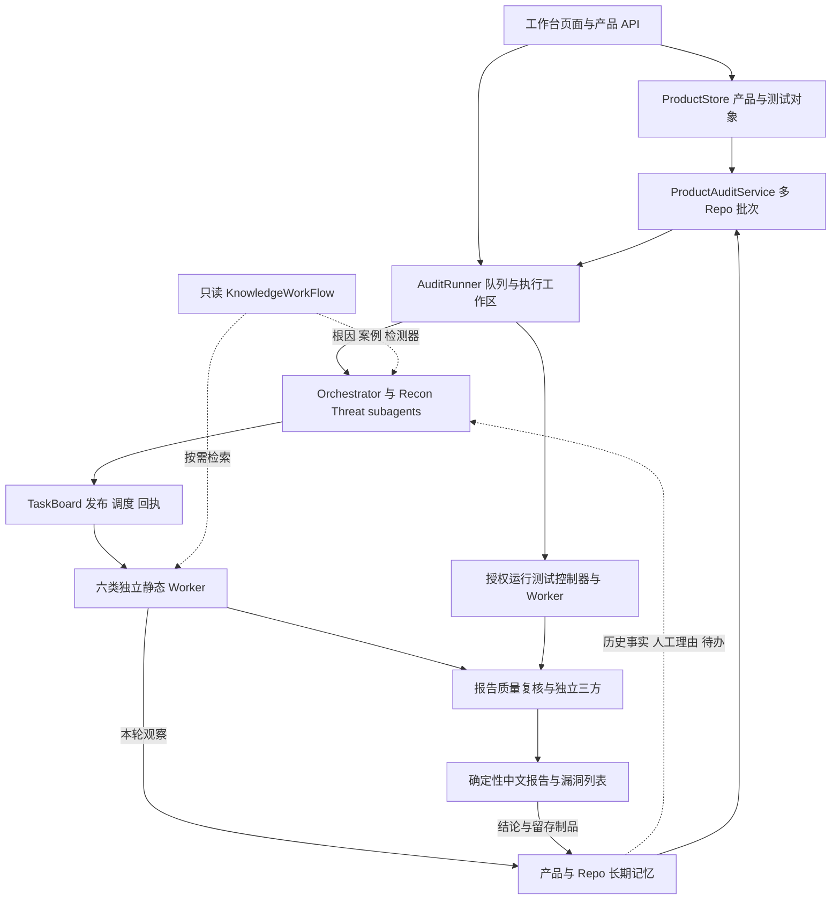
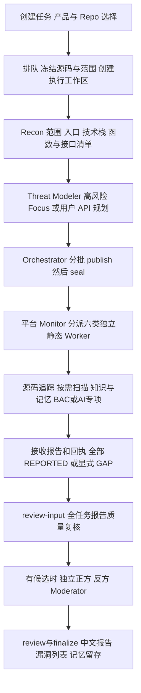
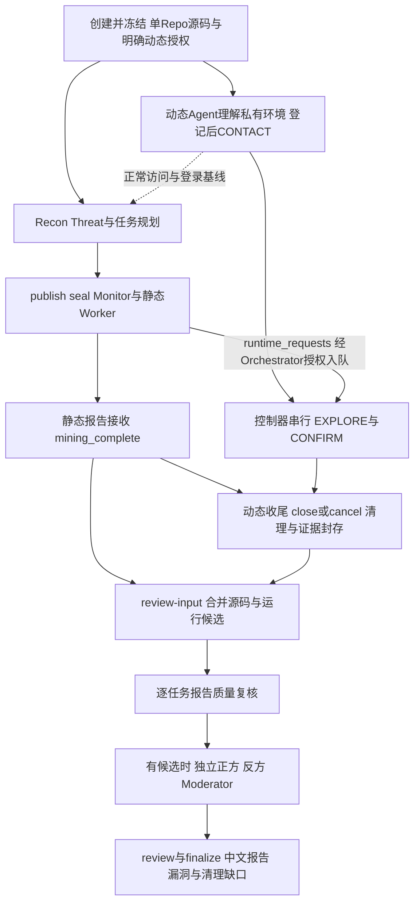
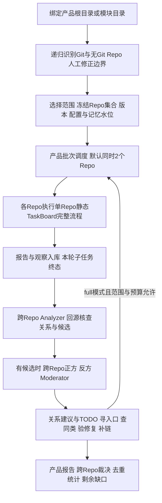

# 漏洞挖掘工作台项目设计文档

本文说明当前工作台的执行架构、Agent 分工、工具分类、Skills、MCP，以及从任务创建到漏洞复核和报告封存的完整流程。代码快照日期为 **2026 年 9 月 30 日**，包含本工作区尚未提交的 TaskBoard、Agent 静态专项、产品多 Repo 和长期记忆代码。

当前新建审计默认采用 `task-board.v1`：Orchestrator 负责规划和编排，平台 Monitor 启动专业 Worker，独立复核角色核验候选，程序生成中文终稿。单 Repo 支持显式授权的并行运行测试；产品多 Repo 联合审计当前只做静态挖掘。本文描述代码设计，不代表现有工作台进程已经加载这些改动，也不代表全部本机工具或真实模型链路已验收。

配套文件：[可视化阅读版](show-me-workbench-design.html)、[源码清单与摘要](workbench-design-inventory.json)。

## 架构与组件关系

| 组件 | 职责 | 主要实现 |
|---|---|---|
| 工作台前端和产品 API | 产品目录、测试对象、任务、报告、漏洞、动态证据与人工反馈的操作入口 | `web/dynamic-validation-observatory/public/`、`server.mjs` |
| ProductStore | 产品和测试对象归属、目录绑定、执行配置快照 | `product-store.mjs` |
| AuditRunner | 排队、范围与源码绑定、隔离执行工作区、OpenCode 启动、暂停恢复、事件及完成检查 | `audit-runner.mjs` |
| TaskBoardService | 任务发布与封存、专业分派、执行尝试、报告接收、复核和终稿入口 | `lib/task-board/` |
| RuntimeTestingService | 授权、私有环境、工作包队列、环境租约、受控浏览器、证据与清理 | `lib/runtime-testing/` |
| ProductAuditService | 冻结多个 Repo、调度子审计、跨 Repo 分析、定向补审、产品报告 | `lib/product-memory/campaign.mjs` |
| ProductMemoryService 与 Store | 版本快照、接口与资产、覆盖、问题观察、人工反馈、关系、TODO 和查询留痕 | `lib/product-memory/` |
| KnowledgeWorkFlow 适配器 | 只读查询通用安全根因、案例、检测器及质量标记 | `lib/knowledge-workflow.*`、`scripts/knowledge-query.mjs` |

上述实现路径均相对于 `.opencode/`。源码与执行工作区分开；目标源码作为只读输入，报告、临时文件、配置和缓存写入平台管理的输出位置。平台直接运行在宿主机，不使用容器执行链路。

依据：[工作台 Runner](../.opencode/web/dynamic-validation-observatory/audit-runner.mjs)、[TaskBoard 服务](../.opencode/lib/task-board/service.mjs)、[产品批次](../.opencode/lib/product-memory/campaign.mjs)。

## Agents 与 Subagents 分工

### 静态定义的角色

`.opencode/agents/` 有 **19 个定义**：2 个 `primary`、17 个 `subagent`。角色文件和 `roles.json` 中仍保留旧 Tri-Lens 流程描述；实际执行先按平台注入的协议分支选择契约。

| Agent | 定义模式 | 分工 | 当前调用场景 |
|---|---|---|---|
| `security-audit-orchestrator` | primary | 范围协调、委派 Recon/Threat、发布任务、运行假设分派、启动复核、封存终稿；不直接深审源码或操作浏览器 | 当前单 Repo 主编排角色 |
| `security-intel-collector` | subagent | 识别技术栈、入口、敏感操作、配置和 AI 表面，构建范围、函数、接口及路由清单 | 当前 Recon；沿用既有解析能力 |
| `security-threat-modeler` | subagent | 威胁建模；按选定策略规划高风险 Focus Area 或全部用户 API 条目；独立恢复 BAC 预期策略 | 当前规划；BAC 启用时承担独立策略会话 |
| `java-source-auditor` | subagent | Java/JVM 入口、框架、注入、反序列化、授权和数据库访问路径 | 当前 Java Worker 的专业参考；旧协议直接委派 |
| `web-source-auditor` | subagent | JS/TS、HTML、JSP 和模板的浏览器安全、输出及客户端边界 | 当前 Web Worker 的专业参考；HTTP 接口按实现语言路由 |
| `python-source-auditor` | subagent | Python 框架、执行、反序列化、依赖和配置 | 当前 Python Worker 的专业参考 |
| `c-cpp-source-auditor` | subagent | C/C++ 内存安全、原生接口、进程和权限边界 | 当前 C/C++ Worker 的专业参考 |
| `platform-security-auditor` | subagent | 语言无关的依赖、构建、CI/CD、网关、部署、密钥和 IaC；分析目标容器配置源码 | 当前 Platform Worker 的专业参考；不执行目标容器 |
| `ai-security-auditor` | subagent | AI/LLM、Agent、RAG、记忆、工具/MCP、模型供应链；Agent 工具执行与权限专项 | 当前 AI Worker 的专业参考 |
| `vulnerability-validator` | subagent | 逐任务核查报告质量；组织候选的独立正方、反方、裁决 | 当前 TaskBoard 收尾必经；零候选仍做质量复核 |
| `vulnerability-affirmative` | subagent | 独立证明可达性、输入控制、边界突破、影响与运行证据有效性 | 当前有候选时调用 |
| `vulnerability-negative` | subagent | 独立查找守卫、框架语义、前提冲突等反证，再核查正方结果 | 当前有候选时调用 |
| `vulnerability-moderator` | subagent | 核对双方证据，给出 TRUE_POSITIVE / FALSE_POSITIVE / INCONCLUSIVE | 当前有候选时调用 |
| `security-evidence-correlator` | subagent | 旧流程覆盖归一、证据去重、矛盾、缺口和补查包 | 保留给旧 Focus/Tri-Lens 流程；不是默认 TaskBoard 必经模型阶段 |
| `security-finding-adjudicator` | subagent | 旧 Finding v2 的初步语义裁决、守卫和反例检查 | 保留给旧流程；默认 TaskBoard 采用报告复核与三方契约 |
| `security-attack-chain-hunter` | subagent | 跨 Focus Area、资产和信任边界的系统攻击链挖掘 | 保留给旧流程；产品跨 Repo 有独立实现 |
| `security-skill-optimizer` | subagent | 从已裁决结果维护审计 Skills、Joern 规则、漏洞和误报案例 | 旧流程反馈维护角色；默认 TaskBoard 不自动启动它 |
| `quick-dynamic-validator` | subagent | 旧版显式授权的 loopback 快速确认，共享准备最多 240 秒、每报告最多 180 秒 | 旧 quick 协议；当前贯穿式运行测试不调用 |
| `dynamic-vulnerability-validator` | primary | 对已封存 Web 发现进行显式人工补充验证，输出绑定证据 | 保留的人工验证入口；不属于每次静态挖掘必经步骤 |

依据：[角色定义目录](../.opencode/agents/)、[角色注册表](../.opencode/agent-manifest/roles.json)、[当前协议分支](../.opencode/lib/task-board/workflow.md)。

### 平台运行时生成的角色

当前 Worker 由平台另起 OpenCode 会话，使用动态配置中的 `primary` 角色；它们不是 Orchestrator 对每个任务调用 `task` 创建的 subagent。

| 运行角色 | 专业来源或职责 | 启动者 |
|---|---|---|
| `task-board-java-worker` | Java/JVM 漏洞挖掘 | TaskBoard Monitor |
| `task-board-web-worker` | 浏览器与模板源码漏洞挖掘 | TaskBoard Monitor |
| `task-board-python-worker` | Python 漏洞挖掘 | TaskBoard Monitor |
| `task-board-c-cpp-worker` | C/C++ 漏洞挖掘 | TaskBoard Monitor |
| `task-board-platform-worker` | 平台配置与公共边界漏洞挖掘 | TaskBoard Monitor |
| `task-board-ai-worker` | AI 风险；显式选择时执行 Agent 工具边界静态专项 | TaskBoard Monitor |
| `runtime-testing-worker` | 每次只执行一个 CONTACT / EXPLORE / CONFIRM / CLEANUP 包 | 运行测试控制器；只允许 `runtime-browser_*` |
| `security-cross-repo-analyzer` | 核对多 Repo 当前版本的调用、身份传播、共同根因、入口和组合链路，提出候选与 TODO | 产品批次控制器 |
| `cross-repo-affirmative` | 逐项核查跨 Repo 候选的支持证据 | 产品批次控制器；有候选时 |
| `cross-repo-negative` | 检查跨 Repo 参数、身份、守卫、部署与版本差异等反证 | 产品批次控制器；有候选时 |
| `cross-repo-moderator` | 对跨 Repo 候选作独立终局裁决 | 产品批次控制器；有候选时 |

因此有 **11 种运行时角色名称**；这不等于常驻 11 个 Agent，也不能与 19 个定义相加理解为同时执行的实例数。每个专业 Worker 一次处理一个任务，同领域串行、跨领域默认最多 4 个；每次任务建立独立会话。Worker 禁止嵌套 `task`，不持有动态控制连接或私有环境原文。

独立静态 Worker 与跨 Repo 会话共享进程内配额，默认 4，`AUDIT_WORKER_CONCURRENCY` 可设为 1–16。该配额不包含 Orchestrator、其内嵌 subagents 或动态 Worker，不能视为全平台模型并发上限。产品 Repo 子审计另有默认 2、最多 4 的并发限制。

依据：[Worker 配置与分派](../.opencode/lib/task-board/service.mjs)、[运行 Worker](../.opencode/lib/runtime-testing/service.mjs)、[跨 Repo Worker](../.opencode/lib/product-memory/cross-worker.mjs)、[独立会话配额](../.opencode/lib/agent-slots.mjs)。

## 集成工具功能分类

工具、Skill、MCP 和平台服务属于不同层：工具提供操作能力，Skill 提供分析方法与交付契约，MCP 提供受控工具接口，平台服务维护状态与证据。知识检索、任务调度和静态扫描的本地 CLI 不应列为 MCP。

| 分类 | 工具和入口 | 功能与使用边界 |
|---|---|---|
| 基础代码操作 | OpenCode `read/glob/grep/list`、`bash`、`lsp`，Git、rg | 读取源码、定位符号、版本与差异；源码只读由执行契约要求，不代表所有角色的通用 bash 已做操作系统级沙箱 |
| 角色委派 | OpenCode `task` | Orchestrator 委派 Recon/Threat/Validator；Validator 委派三方。独立静态、动态及跨 Repo Worker 禁止再委派 |
| 方法装载 | OpenCode `skill`、集合注册与 SKILL.md | 按专业和风险按需载入方法；集合 owner 是职责映射，不是每个 Skill 的强隔离权限列表 |
| 范围和结构清单 | `build-scope-manifest`、`build-parser-capabilities`、`build-function-manifests`、`build-interface-manifest`、`verify-interface-extractors`、`build-threat-routing-index` | 冻结文件、能力探测、函数/接口和紧凑路由；Java 使用 javac，JS 和其他适用语言使用 Joern，模板有嵌入式提取；不可用保留 GAP |
| 基础静态扫描 | `static-scan.mjs`、OpenGrep / Semgrep | doctor、plan、run、verify、aggregate；执行选定规则并生成摘要绑定 SARIF；命中只是线索，未命中不关闭覆盖 |
| 密钥和依赖扫描 | Gitleaks、OSV-Scanner | 可选的敏感值和依赖风险扫描；是否能执行取决于实际安装与适用性 |
| 深度静态分析 | `joern-parse`、`joern`、`joern-rules/` | AST/CPG、调用者与数据流规则；直接 CLI，未注册成 MCP；缺失不阻断基础模式扫描，相关函数/数据流声明保留限制 |
| 知识检索 | `knowledge-query.mjs` → Python 原生知识索引 | 根因、案例、检测器、分类和质量的只读查询；保留来源摘要、过期及 PARTIAL 信息；blind 在读库前跳过 |
| TaskBoard 控制 | `task-board.mjs` → 私有 loopback 服务 | 发布、seal、status/list/wait、skip、review-input、bind、review、finalize；状态由平台维护，Agent 不直接改队列 |
| 越权专项 | `bac-analysis.mjs`、ACP Skill、Java 路径分析、BAC Python 校验 | 独立预期 D/O/R/AC，与入口到数据库实际控制作差分；未知不能当作缺失；TaskBoard 使用 `bac-task-plan.v1` |
| Agent 静态专项 | `agent-mining.mjs`、`lib/agent-mining/` | prepare 定位和知识快照；Agent 追踪调用与权限；finish 核查绑定和必要证据，区分 CANDIDATE / LEAD / GAP；不构建攻击 prompt 或执行目标工具 |
| 运行测试与浏览器 | `runtime-testing.mjs`、`runtime-browser`、Chrome DevTools MCP | 按明确授权登记环境、排队测试、收集证据与清理；同环境串行、身份隔离、origin 代理限制；不是通用网络访问能力 |
| 人工补充与桌面探针 | `dynamic-validation-cli.mjs`、`windows-control-*`、winapp CLI | 补充动态验证保留独立 sidecar；Windows 控件探针默认禁用、只适用于授权 Windows 测试夹具 |
| 产品长期记忆 | `audit-memory.mjs` → 私有记忆 API、SQLite `pm_*` | context/search/show/issue/compare/propose/todos/todo-create/todo-answer；记录事实、理由、版本、关系和 TODO；Worker 不能修改人工判断 |
| 报告与证据 | TaskBoard report/review 模块、Finding 校验、SARIF、摘要与受控路径 | 接收回执、保存独立报告副本、核查真实会话和逐项覆盖、生成中文终稿；结构校验不替代语义判断 |
| 旧流程兼容 | `audit-todo.mjs`、coverage/Stage/Finding v2/CVSS/attack-chain 脚本、watchdog plugin | 恢复历史 `local-todo.v1` 制品及旧流水线；默认 TaskBoard 不使用旧账本或 Stage 门禁决定完成 |

这些是代码已集成的能力，不是本机安装成功清单。默认专业 Worker 关闭 `webfetch/websearch` 和浏览器 MCP；不能把全局配置的 allow 理解为每个 Worker 都可联网。依据：[扫描入口](../.opencode/scripts/static-scan.mjs)、[函数提取入口](../.opencode/skills/common-subagent/audit-coverage-accounting/scripts/build-function-manifests.mjs)、[知识适配器](../.opencode/lib/knowledge-workflow.mjs)。

## Skills 功能清单

项目内有 **14 个集合、56 个 SKILL.md**。以下仅统计工作台 `.opencode/skills/` 的能力；本次用于出图的 show-me、文档规范 write-page，以及助手个人安装的 Skills 不属于产品集成清单。链接指向集合目录，每行对应其中同名目录的 `SKILL.md`。

### 通用审计方法

集合：[common-subagent](../.opencode/skills/common-subagent/)，7 项，共享。

| Skill | 功能简述 |
|---|---|
| `secure-code-review-common` | 通用审查方法，围绕威胁、输入到影响、有效守卫及证据分析 |
| `audit-coverage-accounting` | 范围、文件、函数、接口、目录和语义覆盖的构建与校验；全量覆盖账本主要用于旧流程 |
| `audit-artifact-management` | 制品路径、摘要、阶段与角色交付、报告留存；包含旧八阶段契约 |
| `focus-area-vulnerability-discovery` | Focus 内的覆盖、盲审和案例引导变体挖掘，区分发现与覆盖闭合 |
| `finding-evidence-contract` | Finding 结构、证据绑定和外部运行验证交接契约 |
| `finding-adjudication` | 候选的独立语义裁决、守卫与反例；主要对应旧 Finding v2 流程 |
| `detect-bac-risks` | 比较预期数据库访问策略与实际路径，保留未知并转为静态候选 |

### 侦察和威胁建模

| 集合与主要角色 | Skill | 功能简述 |
|---|---|---|
| [security-intel-subagent](../.opencode/skills/security-intel-subagent/) · Intel | `security-recon` | 五层攻击面、入口、sink、敏感操作、配置与 AI 表面清单 |
| [threat-modeling-subagent](../.opencode/skills/threat-modeling-subagent/) · Threat | `evidence-backed-threat-modeling` | 资产、主体、安全不变量、信任边界、攻击故事和风险规划 |
| 同上 | `extract-acp-quadruples` | 独立恢复预期数据库访问策略的 D/O/R/AC 四元组，不扩展原模型 |

### Java 和 JVM 审计

集合：[java-subagent](../.opencode/skills/java-subagent/)，26 项，主要角色 `java-source-auditor` / Java Worker。

| Skill | 功能简述 |
|---|---|
| `java-web-comprehensive-review` | Java/JVM 与服务端 Web 的综合审查入口，组织适用风险与证据 |
| `java-web-security-review` | Web 认证授权、Spring Security、文件、SSRF 与框架配置 |
| `java-access-path-analysis` | 入口到数据库路径、角色和归属控制，供 BAC 差分分析 |
| `java-injection-review` | SQL、JPQL、LDAP、XPath、模板、表达式、命令与类加载注入总览 |
| `java-deserialization-review` | 对象映射、gadget 链、多态类型和类型解析综合检查 |
| `java-sql-injection` | JDBC、MyBatis、JPA 等 SQL/查询拼接、动态标识符与二次注入 |
| `java-nosql-injection` | MongoDB 查询、JSON 操作符、SpEL 和相关脚本输入 |
| `java-ldap-injection` | LDAP filter 与 DN 的输入编码、拼接和参数化 |
| `java-xpath-injection` | XPath 查询构造和变量绑定 |
| `java-command-injection` | Runtime.exec、ProcessBuilder 等命令与参数边界 |
| `java-spel-injection` | SpEL 求值上下文、表达式输入与允许范围 |
| `java-xss` | 响应、JSP 与模板输出的上下文编码和净化 |
| `java-xxe` | XML 外部实体、DTD、XInclude 与解析器安全配置 |
| `java-jwt-misuse` | JWT 签名、算法混淆、密钥及 exp/aud/iss 等声明验证 |
| `java-csrf` | Cookie 认证的状态修改入口与 CSRF 防护 |
| `java-idor` | 对象、租户、角色和父子资源的授权绑定 |
| `java-deserialization` | ObjectInputStream、Fastjson、Jackson、YAML 等危险对象重建 |
| `java-path-traversal` | 文件读写删除、归档解压、Zip Slip 与根目录约束 |
| `java-file-upload` | 上传类型、命名、存储和 Web 可访问位置 |
| `java-ssrf` | 服务端目标地址、协议、端口、重定向与允许列表 |
| `java-resource-exhaustion` | 分配、分页、批量、递归、队列与并发参数的上下限 |
| `java-open-redirect` | 重定向目的地验证与编码、相对路径等绕过条件 |
| `java-weak-cryptography` | 算法、模式、IV、随机数与口令哈希 |
| `java-hardcoded-secrets` | 源码与配置中的密码、密钥、JWT secret 和云凭证 |
| `java-log-injection` | 日志换行、伪造记录和输出边界 |
| `java-mass-assignment` | HTTP/JSON 自动绑定对权限、归属、余额和状态字段的覆盖 |

综合 review 与同类专项 Skill 是不同粒度的方法资产，不表示同一文件会被重复调度两次。

### Web Python C++ 和平台审计

| 集合与主要角色 | Skill | 功能简述 |
|---|---|---|
| [web-subagent](../.opencode/skills/web-subagent/) · Web | `web-source-security-review` | JS/TS、HTML、JSP 及各类模板的输出、浏览器行为与安全边界 |
| [python-subagent](../.opencode/skills/python-subagent/) · Python | `python-web-framework-review` | Django、Flask、FastAPI、Starlette 的认证、CSRF/CORS、文件和配置 |
| 同上 | `python-execution-review` | 命令、动态代码、插件、import 与模板求值 |
| 同上 | `python-deserialization-review` | pickle、YAML、jsonpickle 等对象重建 |
| 同上 | `python-dependency-config-review` | 依赖、配置加载、密钥、日志与部署默认值 |
| [c-cpp-subagent](../.opencode/skills/c-cpp-subagent/) · C/C++ | `c-cpp-memory-safety-review` | 越界、UAF、double free、整数溢出、格式化与栈安全 |
| 同上 | `c-cpp-native-boundary-review` | 原生接口、IPC、系统调用、插件与 FFI 信任边界 |
| 同上 | `c-cpp-file-privilege-review` | 文件、进程、临时文件、符号链接与权限处理 |
| [platform-subagent](../.opencode/skills/platform-subagent/) · Platform | `platform-security-review` | 依赖、构建、CI/CD、网关、密钥、网络、IaC 与部署制品 |

### AI 和 Agent 专项

集合：[ai-subagent](../.opencode/skills/ai-subagent/)，2 项，主要角色 `ai-security-auditor` / `task-board-ai-worker`。

| Skill | 功能简述 |
|---|---|
| `ai-system-security-review` | AI/LLM、Agent、RAG/vector、记忆、工具/MCP、模型供应链与评估风险 |
| `agent-tool-boundary-mining` | API/function/skill/MCP 导致的工具执行 RCE、越权调用、框架访问控制绕过；只做证据驱动的静态挖掘 |

### 复核 动态和知识维护

| 集合与主要角色 | Skill | 功能简述 |
|---|---|---|
| [evidence-correlation-subagent](../.opencode/skills/evidence-correlation-subagent/) · Correlator | `tri-lens-evidence-correlation` | 旧流程覆盖归一、去重、冲突、缺口和后续工作包 |
| [attack-chain-subagent](../.opencode/skills/attack-chain-subagent/) · Chain Hunter | `system-attack-chain-hunting` | 跨模块和信任边界组合攻击链，核查每个连接条件 |
| [vulnerability-validator-subagent](../.opencode/skills/vulnerability-validator-subagent/) · Validator | `vulnerability-validation` | 按版本消费运行或旧 quick 证据，组织独立三方真实性复核 |
| [dynamic-vulnerability-validator-subagent](../.opencode/skills/dynamic-vulnerability-validator-subagent/) · Manual Dynamic | `web-runtime-validation` | 显式人工请求的非 XSS Web 验证，保留 loopback 旧契约 |
| 同上 | `web-xss-runtime-validation` | 授权 localhost XSS 验证，强调应用提交、重访和隔离身份 |
| 同上 | `winapp-ui-automation` | 授权 Windows 测试程序的控件、窗口、状态检查与最小截图 |
| [security-skill-optimizer-subagent](../.opencode/skills/security-skill-optimizer-subagent/) · Optimizer | `audit-skill-optimization` | 根据已裁决结果调整方法和提示，保持角色边界 |
| 同上 | `joern-rule-maintenance` | 从真假裁决维护 Joern 规则和元数据 |
| 同上 | `audit-casebase-maintenance` | 维护带维度、视角和反例的漏洞与误报案例 |

`runtime-testing-worker` 采用控制器专用 prompt 和受控 MCP，不自动加载上述人工动态 Skills。Skills 的存在、角色允许装载、实际选用是三个不同状态。依据：[集合映射](../.opencode/agent-manifest/skill-map.json)、各集合 `collection.json` 与 `SKILL.md`。

## MCP 功能与启用状态

当前项目配置及模板均有 **6 个 MCP 配置项**：1 个配置启用，1 个实验默认禁用，4 个未启用占位。贯穿式动态测试执行时另注入 **1 个临时网关**。

| MCP | 功能简述 | 当前状态与消费者 |
|---|---|---|
| `chrome-devtools` | Chrome 页面、导航、真实表单交互、DOM 快照、控制台和网络证据 | 配置启用，固定 `chrome-devtools-mcp@1.8.0`；默认静态角色禁止使用。旧 quick/manual 角色直接使用；新运行测试由控制器按身份创建隔离实例 |
| `runtime-browser` | `register_sensitive_values` 脱敏登记；`configure_environment` 环境登记；`browser_tools` 发现获准工具；`browser_call` 代理调用；`submit_result` 提交结果并结束租约 | 动态生成，非全局常驻配置；只向 `runtime-testing-worker` 开放。底层仍使用 Chrome DevTools MCP |
| `windows-control` | status、inspect、set_value、invoke、get_state、wait_for、cleanup、close；只操作登记控件和本次 marker | 实验实现，默认 disabled；Windows 授权夹具探针，未接入默认 TaskBoard/运行测试调度 |
| `cpp_index` | 规划中的 C/C++ 符号、调用图和构建元数据索引 | placeholder，disabled；专业权限映射保留，不代表服务已经实现或可调用 |
| `jvm_index` | 规划中的 JVM 依赖、框架与调用关系索引 | placeholder，disabled |
| `python_index` | 规划中的 Python import、框架与调用关系索引 | placeholder，disabled |
| `audit_lab` | 规划中的受控本地验证辅助 | placeholder，disabled |

运行链路是 `runtime-testing-worker → runtime-browser → 控制器租约与 origin 代理 → Chrome DevTools MCP → 授权环境`。登记完成前不启动浏览器；静态候选或运行请求文件本身不授予执行许可。

Joern、知识库、TaskBoard、长期记忆均不属于 MCP。旧覆盖账本仍有本地核心与脚本，但当前配置没有 `coverage_ledger` MCP。`context7`、`gh_grep`、CodeQL 和外部 truth-review MCP 不在当前项目配置中。用户全局 OpenCode 配置可能另有扩展，本文未把未核实的全局扩展算入产品清单。

依据：[本机项目配置](../.opencode/opencode.json)、[可提交配置模板](../.opencode/opencode.json.bak)、[MCP 映射](../.opencode/agent-manifest/mcp-map.json)、[动态网关](../.opencode/lib/runtime-testing/worker-mcp.mjs)、[浏览器控制器](../.opencode/lib/runtime-testing/browser.mjs)、[Windows MCP](../.opencode/scripts/windows-control-mcp.mjs)。

## 完整漏洞挖掘流程

### 单 Repo 未激活动态测试

动态开关关闭或环境文本为空时记 `SKIPPED`，不启动动态 Agent、浏览器或目标请求。知识库和长期记忆按模式在 Recon、规划、挖掘和复核中按需读取；本轮观察在报告接收后入库。图中 BAC/AI 为按配置选择的分支，不要求每个任务都执行两种专项。

Focus 与 API 是互斥策略。Focus 规划高风险主题；API 针对用户输入的每条清单建立任务，一个 API 可以有并列专业任务。当前 TaskBoard 不承诺自动覆盖整个 Repo 的全部接口，不以旧 Tri-Lens 全量账本作为终稿门禁。

### 单 Repo 激活动态测试

CONTACT 与 Recon 并行。静态 Worker 输出假设或候选的 `runtime_requests`；Orchestrator 使用原有授权校验并入队，Worker 继续静态工作。控制器按环境租约串行执行工作包；每包可以创建新的 `runtime-testing-worker` 会话，各身份的 Chrome 实例隔离。因此这是静态与动态执行链的并行协作，不是两个无限存续、任意互发消息的 Agent。

情报交换通过平台制品和状态完成：动态侧返回正常基线、观察、支持或反证；Orchestrator 将获准的公开证据传给专业分析；静态侧返回假设、源码定位和确认包。私有环境原文和凭据不交给静态 Worker。动态异常或必要信息缺失保留具体缺口，静态流程继续；封存时 close 或 cancel，不无限等待。

该图的前提是用户显式启用并提供授权环境；启动运行测试前仍需平台能力可用。`SUPPORTED` 仅是运行支持证据，所有候选继续经过三方复核。没有源码映射的观察保持 `RUNTIME_ONLY/UNKNOWN`，仅对相应授权环境成立。当前 Agent 工具边界静态专项本身不构建攻击 prompt 或提交动态包，即使该审计另行启用了其他运行测试。

依据：[TaskBoard 协议](../.opencode/lib/task-board/workflow.md)、[运行测试协议](../.opencode/lib/runtime-testing/workflow.md)、[复核实现](../.opencode/lib/task-board/review.mjs)。

### 产品和模块的多 Repo 流程

跨 Repo 分析在本轮子任务终态后运行；静态 Worker 执行期间可查询同产品已经接受的观察，控制器也会检查新增 TODO。当前没有“每新增一条观察就唤醒跨 Repo 模型”的流式机制。

目录发现优先识别 `.git` 目录或文件；无 Git 源码根据构建清单、源码与布局启发式识别，复杂边界由用户指定 Repo、模块或忽略。中间结构目录形成产品模块，普通 `src` 目录不自动拆成模块；`.gitmodules` 保留待核对提示。目录不完整时保留 UNKNOWN，嵌套重叠的 Repo 不能共同派发。首次绑定、工作台启动、每 5 分钟及手动刷新都会触发发现。

每批次最多 100 个 Repo；Repo 并发 1–4，默认 2；最多 20 个定向补审任务、2 轮补审、3 轮跨 Repo 分析。补审只派给本批次已选 Repo，其他范围 TODO 留存。无跨 Repo 候选时不创建三方会话。版本漂移或无法证明连接条件时保留 GAP；不把相同 CWE 或标题直接认定为重复问题。联合入口当前不执行动态测试。

依据：[产品目录发现](../.opencode/lib/product-memory/topology.mjs)、[批次调度与预算](../.opencode/lib/product-memory/campaign.mjs)、[跨 Repo 契约](../.opencode/lib/product-memory/cross-worker.md)。

### 两类专项如何进入主流程

| 专项 | 输入与分析 | 交付与最终结论 |
|---|---|---|
| 数据库越权 BAC | 独立 Threat/ACP 会话恢复预期 D/O/R/AC；适用源码 Worker 提取实际入口到数据库路径、角色和归属控制；进行差分 | `bac-task-plan.v1` 绑定源码、任务、attempt 与策略；候选进入主三方，专项缺口独立保留。COMPLETE 仅表示声明范围的比较闭合 |
| Agent 工具和框架边界 | 显式 `domain=ai` 和 `agent-tool-boundaries.v1`；prepare 提供有界定位、知识快照与模板；AI Worker 追踪入口、分派、执行身份、应有策略、有效守卫及反例 | finish 检查摘要、位置、调用边、覆盖与知识引用；证据不足为 LEAD/GAP，CANDIDATE 交主三方。动态 NOT_RUN 不冒充验证完成 |

Agent 专项覆盖 `TOOL_RCE`、`TOOL_AUTHZ`、`FRAMEWORK_ACCESS` 三个风险族，以及 API call、function call、skill、MCP 四种调用边界。工具具有执行能力不自动等于 RCE；必须证明低信任主体能突破获准能力。该权限模型不强行套入只描述数据库访问的 BAC 四元组。

依据：[BAC 工作流](../.opencode/lib/bac/workflow.md)、[Agent 专项](agent-vulnerability-mining.md)。

## 知识库 长期记忆与人工反馈

| 存储 | 内容与目的 | 读写方式 |
|---|---|---|
| 通用知识库 | 安全不变量、根因、条件、反例、案例、检测器和质量状态，辅助识别同类机制 | KnowledgeWorkFlow 本地只读检索；不执行案例 PoC，不自动写回外部库 |
| Repo 长期记忆 | 当前和历史接口、资产、覆盖、发现、缺口、完整性与版本差异，辅助回归和新增点分析 | Agent 私有记忆 CLI；平台绑定产品/Repo/快照/真实会话，按摘要留存 |
| 产品长期记忆 | 跨 Repo 观察、同一问题、共同根因、同类模式、组合链和待办 | 有界产品查询、跨 Repo 分析与建议；建议和人工确认分开 |
| 人工反馈 | 真漏洞、误报、证据不足、整改状态、理由与重复关系 | 漏洞详情及问题列表；版本化保存，Agent 不能替用户改判 |

记忆读取模式为 `full`、`facts_only`、`off`、`blind`。full 可读取事实、人工理由和产品经验；facts_only 只提供接口、资产、覆盖、关系、清单与缺口等事实记录；off/blind 隔离历史读取，其中 blind 还隔离知识种子。模式不等于删除记录或停止保留本轮事实。

只有完整范围、相同提取器版本的清单才能把缺失接口或资产算作“减少”；否则为 UNKNOWN。历史误报不会自动屏蔽新候选，修复状态也不会由 Agent 自动改成已验证。相同 Repo、实体和源码证据可继承问题身份；源码变化或仅标题/CWE 相似不自动合并。

源码快照保存清单与内容摘要，仍引用原只读目录，不是自动复制或 checkout 的源码副本。查询保存读取水位和实际返回内容；报告入库保存独立摘要副本。旧观察版本未知时保留未知，不能套用当前版本作证。

依据：[产品长期记忆实现](product-memory-implementation.md)、[记忆存储](../.opencode/lib/product-memory/store.mjs)、[知识查询说明](../.opencode/lib/knowledge-workflow.md)。

## 状态 证据与完成条件

| 状态或门禁 | 含义 |
|---|---|
| `PENDING → RUNNING` | 绑定唯一 attempt 与 30 分钟执行租约 |
| `RUNNING → REPORTED` | 报告和回执已接收；尚未确认质量或漏洞真实性 |
| `FAILED` | 累计三次实际执行失败，需处理或显式说明 GAP；暂停和服务中断不消耗失败次数 |
| `GAP` | 具体未完成范围与原因，终态但不计作报告交付 |
| `mining_complete` | 发布已封存，全部任务 REPORTED/GAP；报告交付 100% 仍需复核与封存 |
| `review-input / review` | 核对摘要副本、全任务质量、全候选覆盖、不同真实会话与上下游摘要 |
| `finalize` | 确定性生成报告与 canonical findings；Moderator TRUE_POSITIVE 才进入确认源码漏洞 |
| `delivery_outcome=NO_REPORTS` | 非空任务却没有任何报告，封存的是执行失败记录，不能声明未发现漏洞或审计成功 |

最终制品包括 `reports/task-board/<audit_id>/reports/`、`reports/validation/`、可选 `reports/runtime-testing/<audit_id>/`、`reports/final/task-board-report-model.<audit_id>.json` 和中文 `security-audit-report.<audit_id>.md`。实际根目录由平台注入。产品 SQLite 的 `pm_*` 表、`product-memory/` 和 `product-audits/` 保存跨轮次事实、查询留痕和产品批次。

恢复沿用原审计、策略和已接收报告，不重跑已交付任务；重试创建新审计 ID。发布或报告已封存后不追加本轮范围、不覆盖原结论，新增线索进入后续审计或 TODO。人工动态 sidecar 不自动改写封存终稿。

## 当前实现与文档差异

本设计以配置和协议分支为准。现有 README 部分描述仍属于旧流程：包括 `coverage_ledger` MCP 启用、旧八阶段门禁和完整 Tri-Lens 全范围分区；这些不应直接解释为默认 TaskBoard 的行为。MCP 映射中的 Chrome 文案提到 `latest`，而当前配置和控制器实际固定为 `1.8.0`。`roles.json` 的职责也需结合角色文件顶部的新协议分支阅读。

产品多 Repo 和长期记忆已有核心代码及替身、进程内行为测试；真实模型四会话链路、浏览器视觉、宿主端口和终端集成仍有未完成验证，现有服务尚未在此前实现任务中重启。本文不根据文件存在推断这些能力已部署，也不重新启动任务或测试环境。具体范围见 [实现验证记录](product-memory-implementation.md)。

本次仅生成设计文档、源码清单和 HTML 图解，并核对角色、集合、Skill 及 MCP 的计数与对应关系。
